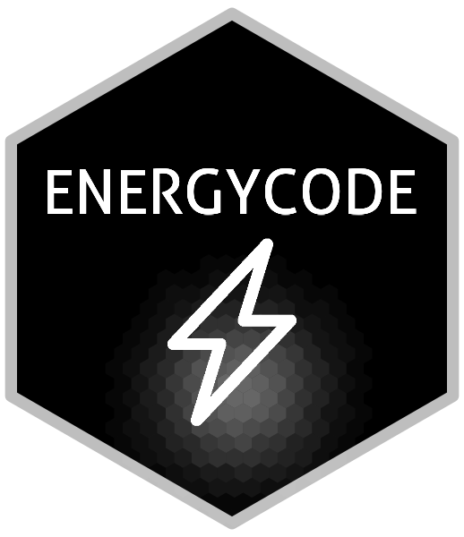

<!-- badges: start -->

<div align="center">

[](https://opensource.org/licenses/MIT)
[](https://github.com/EnriquePH/energycode/commits)
[](https://github.com/EnriquePH/energycode)
[](https://quarto.org)
[](https://app.netlify.com/sites/energycodeorg/deploys)
[](https://github.com/EnriquePH/energycode/actions/workflows/publish.yml)
[](https://github.com/EnriquePH/energycode/security/code-scanning)
[](https://www.energycode.org)
[](https://www.r-project.org)
[](https://www.python.org)
[](https://github.com/EnriquePH/energycode/commits)

</div>

<!-- badges: end -->

# ENERGYCODE

<p align="center">
  <a href="https://www.energycode.org">
    
  </a>
</p>

Source for **[energycode.org](https://www.energycode.org)**, a technical blog on
mathematics, statistics, data science and scientific computing. It is a
[Quarto](https://quarto.org) website: posts are `.qmd` documents with executable
R and Python cells, rendered to static HTML and deployed to Netlify and GitHub
Pages. Posts are written in English or Spanish (`lang: es`).

RSS feeds: [posts](https://www.energycode.org/index.xml) ·
[projects](https://www.energycode.org/projects.xml)

## Stack

| Layer | Tool | Version / config |
| --- | --- | --- |
| Site generator | Quarto | ≥ 1.9 (CI pins `1.9.14`) |
| R execution | knitr | R 4.4, packages in [`packages.txt`](packages.txt) + [`marketconf`](https://github.com/EnriquePH/marketconf) |
| Python execution | Jupyter (`python3` kernel) | Python 3.11, packages in [`requirements.txt`](requirements.txt) |
| Theme | Bootswatch | `lux` (light) / `darkly` (dark) |
| Math | KaTeX | set for all posts in `posts/_metadata.yml` |
| Citations | citeproc + CSL | `aims-mathematics.csl` by default; `ieee.csl` and `electronic-journal-of-statistics.csl` also available |
| Hosting | Netlify, GitHub Pages | see [Deployment](#deployment) |

## Repository layout

```text
.
├── _quarto.yml           # site config: navbar, theme, freeze, analytics
├── _publish.yml          # quarto publish target (Netlify site id)
├── index.qmd             # blog listing (grid, sorted by date desc)
├── projects.qmd          # projects listing
├── about.qmd
├── posts/
│   ├── _metadata.yml     # defaults for every post: author, KaTeX, CSL, freeze: true
│   ├── *.csl             # citation styles
│   └── DDMMYYYY-slug/    # one folder per post
│       ├── index.qmd
│       ├── *.bib         # post bibliography
│       └── *.png|*.py    # figures and helper scripts
├── projects/             # same structure as posts/, with its own _metadata.yml
├── partials/_footer.html # footer injected via include-after-body
├── img/                  # logo, favicons, shared images
├── _freeze/              # stored execution results (committed)
├── _site/                # rendered site (committed, served by Netlify)
├── packages.txt          # CRAN packages, one per line
├── requirements.txt      # Python packages
├── DESCRIPTION           # R-style metadata so tooling can resolve dependencies
├── Makefile              # setup / render / preview / publish
└── .github/
    ├── workflows/publish.yml   # CI: render and deploy to GitHub Pages
    └── install_packages.R      # installs packages.txt in CI
```

## Local setup

### Prerequisites

- [Quarto](https://quarto.org/docs/get-started/) ≥ 1.9
- R ≥ 4.4 with `remotes`
- Python ≥ 3.11
- System libraries for the R graphics stack (Debian/Ubuntu):

  ```bash
  sudo apt-get install libcurl4-openssl-dev libssl-dev libxml2-dev \
    libpng-dev libjpeg-dev libtiff-dev libfreetype6-dev libfontconfig1-dev \
    libharfbuzz-dev libfribidi-dev libcairo2-dev libmagick++-dev
  ```

### Build

```bash
git clone https://github.com/EnriquePH/energycode.git
cd energycode
make setup      # R packages + Python virtualenv
make preview    # live preview at http://localhost:4444
```

| Target | What it does |
| --- | --- |
| `make setup` | Runs `setup-r` and `setup-py` |
| `make setup-r` | Installs any missing packages from `packages.txt`, plus `marketconf` from GitHub |
| `make setup-py` | Creates `.venv/` and installs `requirements.txt` |
| `make check` | `quarto check` |
| `make render` | Full render into `_site/` |
| `make preview` | `quarto preview` on port 4444 |
| `make publish` | `make render`, then `git add _site` |
| `make clean` | Removes `.quarto/` and `*.quarto_ipynb`; never touches `_site/` or `_freeze/` |

The Makefile exports `QUARTO_PYTHON=.venv/bin/python`, so Python cells always
run in the project virtualenv.

## Code execution and freeze

`freeze: true` is set for `posts/` and `projects/`. When you run
`quarto render` for the whole project, a post's code runs only if it has no
entry in `_freeze/` yet. After that, Quarto reuses the stored output. As a
result:

- A full render, locally or in CI, does not need to re-run old posts. Their
  results come from `_freeze/`, which is committed.
- To re-run a post after editing its code, render that file on its own:

  ```bash
  quarto render posts/DDMMYYYY-slug/index.qmd
  ```

  Then commit the updated `_freeze/` entry together with the source.
- If you rename a post folder, delete its old `_freeze/posts/<old-name>/`
  directory.

## Writing a post

1. Create `posts/DDMMYYYY-slug/index.qmd`. The folder name becomes the URL.
   Use lowercase and no spaces.
2. Add the front matter. Author, KaTeX, CSL and freeze come from
   `posts/_metadata.yml`, so a post only needs:

   ```yaml
   ---
   title: "Post title"
   description: "One-line summary shown on the listing card"
   date: "2026-01-26"
   lang: en            # or es
   categories: [Math, R]
   image: figure.png   # listing thumbnail, relative to the post folder
   bibliography: refs.bib
   draft: true         # drafts are left out of listings, search and the sitemap
   ---
   ```

3. Run `make preview`. When the post is ready, set `draft: false` and run
   `make publish`.

## Deployment

Every push to `main` deploys to both targets:

| Target | URL | Mechanism |
| --- | --- | --- |
| GitHub Pages | [enriqueph.github.io/energycode](https://enriqueph.github.io/energycode/) | [`publish.yml`](.github/workflows/publish.yml) installs R, Python and Quarto on `ubuntu-latest`, runs `quarto render`, and uploads `_site/` with `actions/deploy-pages` |
| Netlify | [www.energycode.org](https://www.energycode.org) | Serves the `_site/` committed to the repo. Run `make publish` before pushing so it is up to date |

## License

- Code: [MIT](LICENSE)
- Written content: [CC BY-SA 4.0](https://creativecommons.org/licenses/by-sa/4.0/)

## Author

Enrique Pérez Herrero:
[GitHub @EnriquePH](https://github.com/EnriquePH) ·
[LinkedIn](https://www.linkedin.com/in/eph3000) ·
[energycode.org](https://www.energycode.org)

Issues and pull requests with corrections are welcome.
