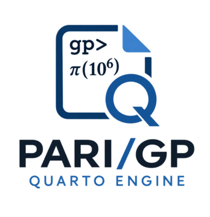

[](https://github.com/oeistools/PARI-GP-ENGINE/actions/workflows/test.yml)
[](https://quarto.org)
[](https://pari.math.u-bordeaux.fr/)
[](https://github.com/oeistools/PARI-GP-ENGINE/blob/main/LICENSE)

{fig-alt="PARI-GP-ENGINE logo" width="220" fig-align="left"}

## Introduction

[PARI/GP](https://pari.math.u-bordeaux.fr/) is a computer algebra system
designed for fast computations in number theory: factorizations, algebraic
number theory, elliptic curves, modular forms and more. **PARI-GP-ENGINE**
brings it to [Quarto](https://quarto.org), so PARI/GP code can live in a
Quarto document, run when the document is rendered, and show its results with
proper syntax highlighting:

👉 https://github.com/oeistools/PARI-GP-ENGINE

The repository provides two parts that fit together but can be used apart:

| Part | What it is |
| --- | --- |
| **Engine** | A Quarto [engine extension](https://quarto.org/docs/extensions/engine.html) that executes `{gp}` cells with the `gp` interpreter and puts the results in the rendered document. |
| **Highlighting** | A KDE/Skylighting syntax definition covering the PARI/GP 2.17 function set, applied automatically, with nothing to configure. |

---

## Features

- **Execution.** `{gp}` cells run in one `gp` session per document, so state
  carries from cell to cell, exactly as it would at the `gp` prompt.
- **Highlighting.** The full function set of PARI/GP 2.17 is recognized out of
  the box.
- **Figures.** Plots exported as SVG become real Quarto figures, with captions
  and cross-references.
- **Errors that behave.** A PARI/GP error stops the render and tells you which
  cell failed, unless you asked for the error to be part of the document.

---

## Installation

```bash
quarto add oeistools/PARI-GP-ENGINE
```

Requirements:

- **Quarto ≥ 1.9**, since engine extensions do not exist in earlier versions.
- **PARI/GP ≥ 2.13**, with the `gp` executable on your `PATH`. CI tests
  2.13.3, 2.15.5 and 2.17.3.
- Linux and macOS are tested in CI; Windows is implemented but not tested.

---

## Usage

Set `engine: pari-gp` in the front matter, then write `{gp}` cells:

````markdown
---
title: "Mersenne factors"
engine: pari-gp
format: html
---

```{gp}
M = 2^101 - 1
factor(M)
```
````

## A taste

Factoring $p - 1$ for the first prime after $10^{40}$:

```gp
p = nextprime(10^40)
factor(p - 1)
```

```
10000000000000000000000000000000000000121
[                      2 3]
[                      5 1]
[                     11 1]
[                     17 1]
[                  12973 1]
[             1821309023 1]
[56581485446137975519811 1]
```

The class number and regulator of $\mathbb{Q}(\sqrt[3]{2})$:

```gp
K = bnfinit(x^3 - 2, 1);
[K.no, K.reg]
```

```
[1, 1.3473773483293841009181878914456530463]
```

And because the session persists, its fundamental units are still one cell
away:

```gp
K.fu
```

```
[Mod(x - 1, x^3 - 2)]
```

---

## License

PARI-GP-ENGINE is distributed under the [MIT
License](https://github.com/oeistools/PARI-GP-ENGINE/blob/main/LICENSE).
PARI/GP itself is GPL software by the PARI Group; since `gp` runs as an
external program, its GPL does not reach the extension code.

## Links

- [GitHub - PARI-GP-ENGINE](https://github.com/oeistools/PARI-GP-ENGINE)
- [Documentation](https://oeistools.github.io/PARI-GP-ENGINE/)
- [Get started](https://oeistools.github.io/PARI-GP-ENGINE/getting-started.html)
- [Gallery](https://oeistools.github.io/PARI-GP-ENGINE/gallery.html)
- [PARI/GP home page](https://pari.math.u-bordeaux.fr/)
