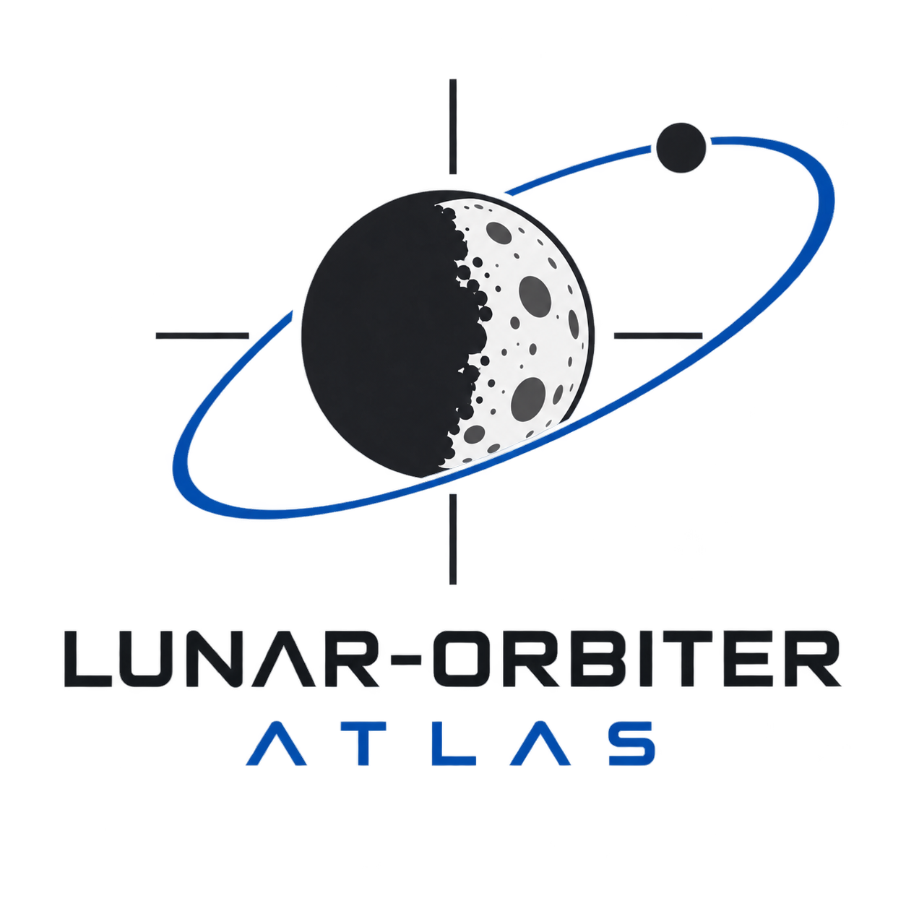
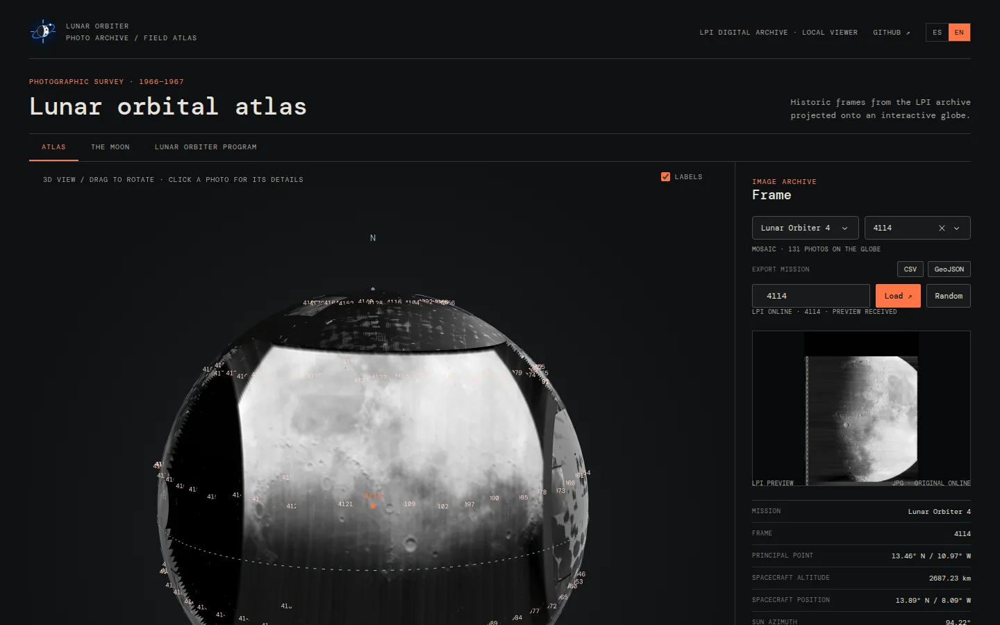

[](https://github.com/EnriquePH/LUNAR-ORBITER-ATLAS/actions/workflows/ci.yml)
[](https://github.com/EnriquePH/LUNAR-ORBITER-ATLAS/actions/workflows/pages.yml)
[](https://enriqueph.github.io/LUNAR-ORBITER-ATLAS/)
[](https://www.python.org/)
[](https://dash.plotly.com/)
[](https://github.com/EnriquePH/LUNAR-ORBITER-ATLAS/blob/main/LICENSE)

{fig-alt="LUNAR-ORBITER-ATLAS logo" width="220" fig-align="left"}

## Introduction

Between 1966 and 1967, NASA sent five **Lunar Orbiter** spacecraft to map the
Moon and pick safe landing sites for Apollo. Their cameras returned hundreds of
frames that are still some of the most beautiful pictures of the lunar surface.
The [Lunar and Planetary Institute (LPI)](https://www.lpi.usra.edu/resources/lunarorbiter/)
keeps them online, frame by frame, with the metadata of every shot.

**LUNAR-ORBITER-ATLAS** is a local web app, written in Python with
[Dash](https://dash.plotly.com/) and [Plotly](https://plotly.com/python/), that
puts those photographs back where they were taken: on an interactive 3D Moon.

👉 https://github.com/EnriquePH/LUNAR-ORBITER-ATLAS

{fig-alt="Screenshot of the atlas showing the Lunar Orbiter 4 mosaic on the 3D globe and frame 4114 in the side panel" fig-align="center"}

---

## Features

- **Mission mosaic.** Every frame of the selected mission (890 frames over the
  five missions) is projected onto the part of the Moon it photographed and
  labelled with its frame ID.
- **Picking photos.** Click a photo, choose it from the selector, type its ID
  or press **Random** to show it in the side panel.
- **Close-up navigation.** Rotation and zoom slow down near the surface, and
  the camera can come down to about 17 km above it.
- **Frame details.** LPI preview, principal point, spacecraft altitude and
  position, illumination angles (sun azimuth, incidence, emission, phase),
  camera (80 mm or 610 mm) and ground footprint in km.
- **Export.** Download the loaded frames of a mission as **CSV** (metadata and
  geometry) or **GeoJSON** (projected footprints as polygons).
- **Reference tabs.** Short facts about the Moon and the Lunar Orbiter
  program, summarised from Wikipedia.
- **English and Spanish.** Switch with the **ES | EN** control, or open
  `?lang=en` / `?lang=es`.

---

## How photos are placed

The interesting part is geometry. A photo is not just pasted on the globe:
each frame is projected **from the spacecraft**. Every pixel becomes a ray that
starts at the spacecraft position published by the LPI, goes through the
camera aimed at the principal point, and lands where it meets the Moon. So
oblique and high-altitude shots cover the area they really saw, and pixels that
look past the limb are dropped.

| Aspect | How it is handled |
| --- | --- |
| **Camera** | The 80 mm medium-resolution frame (55 × 65 mm) when the gallery has one, otherwise the middle third of the 610 mm high-resolution frame. From 46 km the model covers 31.7 × 37.5 km, against the documented 31.6 × 37.4 km. |
| **Check** | For the 890 frames, the emission angle implied by the spacecraft position matches the LPI's with a median error of 0.06°. The 22 frames whose metadata disagree by more than 5° fall back to a simple north-up patch. |
| **Orientation** | The image rotation is not published: near-vertical frames are drawn north-up, oblique ones level with the horizon, and high-altitude frames are turned so their black sky falls off the Moon. |
| **Limits** | Terrain relief and lens distortion are ignored; positions are as good as the published metadata. |

The coordinate conversions are public, so they can be reused in other
projects: `selenographic_to_cartesian` and `cartesian_to_selenographic` in
`orbiter.globe`.

---

## Installation

Requires **Python ≥ 3.10**, on Linux or macOS.

```bash
git clone https://github.com/EnriquePH/LUNAR-ORBITER-ATLAS.git
cd LUNAR-ORBITER-ATLAS
make install   # create .venv and install the app
make download  # optional: fetch all 890 photos now (MISSIONS="1 4" to limit)
make run       # start the app
```

Then open <http://127.0.0.1:8050/>. Without `make`:

```bash
python3 -m venv .venv
.venv/bin/python -m pip install -e .
.venv/bin/lunar-orbiter
```

The first time a mission is shown, the app downloads the LPI page and thumbnail
of each frame (about 200 per mission) and caches them in `data/lpi/`, politely:
three workers and at most four requests per second. Later runs work from disk.

---

## Exported files

- **CSV**: one row per frame with the LPI metadata (principal point,
  spacecraft position, illumination angles, preview URL), plus `camera`,
  `footprint_width_km`, `footprint_height_km`, `projected` and
  `implied_emission_angle`.
- **GeoJSON**: a `FeatureCollection` with one polygon per frame, following
  the outline drawn on the globe. Coordinates are selenographic degrees, east
  and north positive, **not** WGS 84.

---

## License

The code is distributed under the [MIT
License](https://github.com/EnriquePH/LUNAR-ORBITER-ATLAS/blob/main/LICENSE).
LPI images and metadata belong to their respective owners, and the reference
tabs summarise Wikipedia articles under
[CC BY-SA 4.0](https://creativecommons.org/licenses/by-sa/4.0/).

## How to cite

```
ENERGYCODE (2026). Lunar Orbiter Atlas, version 1.0.0.
https://github.com/EnriquePH/LUNAR-ORBITER-ATLAS
```

For photographs or metadata, also cite the LPI Lunar Orbiter Photo Gallery and
the frame record used.

## Links

- [GitHub - LUNAR-ORBITER-ATLAS](https://github.com/EnriquePH/LUNAR-ORBITER-ATLAS)
- [Project page](https://enriqueph.github.io/LUNAR-ORBITER-ATLAS/)
- [Changelog](https://github.com/EnriquePH/LUNAR-ORBITER-ATLAS/blob/main/CHANGELOG.md)
- [LPI - Lunar Orbiter Photo Gallery](https://www.lpi.usra.edu/resources/lunarorbiter/)
- [Wikipedia - Lunar Orbiter program](https://en.wikipedia.org/wiki/Lunar_Orbiter_program)
